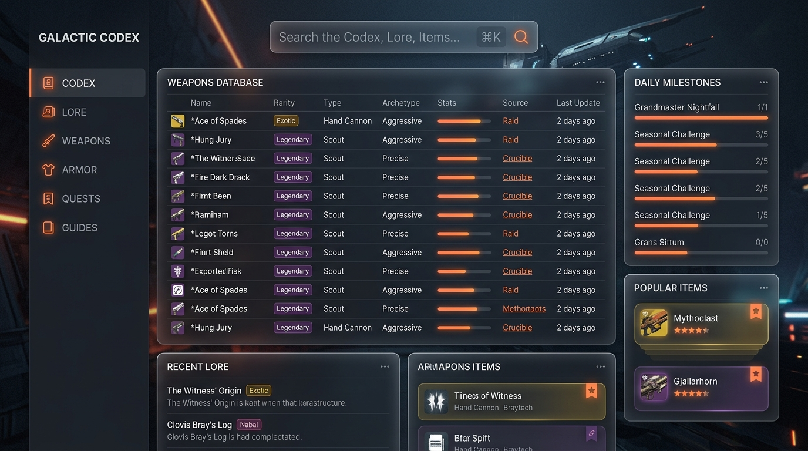
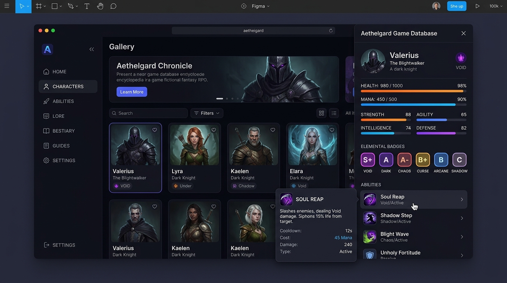
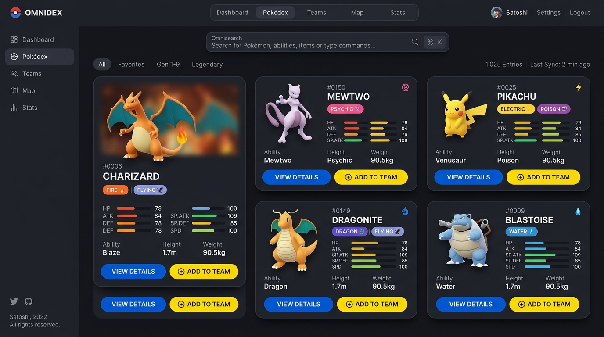

# Moodboard & Direção de Arte - Poke Alliance

## 1. Visão Geral (O Híbrido)
A interface da wiki funde a imersão e a estética "diegética" de jogos modernos com a usabilidade utilitária e minimalista (Zero-Bloat) de ferramentas corporativas (SaaS de alta densidade).

- **Benchmarks de Jogo:** Braytech.org (Destiny 2), poewiki.net, poe.ninja, Raider.IO.
- **Benchmarks de Arquitetura:** Linear, Stripe, Vercel, TradingView.

## 2. Pilares Visuais (Regras de Estética)

1. **Fundo Funcional (Sem AI Slop):** O fundo será predominantemente liso (escala de **Slate/Zinc Escuro**). É expressamente proibido usar wallpapers pesados do jogo que prejudiquem a legibilidade. A imersão visual virá pela tipografia, cards e detalhes (Glassmorphism sutil).
2. **Cor Como Informação:** Cores quentes (Laranja, Neon, Verde, etc) são tratadas como **Dados**. Elas indicam elementos do jogo, status, raridades e alertas. Elementos estáticos e textos comuns recebem cores neutras para **reduzir a fadiga visual**.
3. **Scaffolding Rígido e Grids:** Interfaces tabulares e de catálogos utilizarão **Sticky Headers** (cabeçalhos fixos). Assim, em tabelas massivas de loot ou quests, o jogador nunca perde a referência das colunas durante a rolagem.
4. **Interação Contida (Zero-Squeeze):** O uso pesado de **Drawers** (painéis laterais) e **Tooltips Dinâmicos** evita transições de página (Redirects) desnecessárias. Clicar em um Pokémon abre um drawer, mantendo o jogador no contexto da busca original.

## 3. Conceitos Visuais (Gerados por IA)

### Conceito 1: Dashboard (Data-Ink Ratio)
Estética utilitária, uso de Omnisearch e tabelas rigorosamente alinhadas.

### Conceito 2: Drawers (Progressive Disclosure)
Painel lateral revelando informações avançadas sem perder o contexto (Grid ao fundo). Cores restritas aos badges de Elementos.

### Conceito 3: HÌbrido Oficial (A Alma da Franquia)
A fus„o da arquitetura Zero-Bloat com a identidade visual oficial da franquia.
- **Cores Institucionais:** Azul e Amarelo oficiais aplicados em CTAs.
- **Elementos como Dados:** Cores vibrantes restritas EXCLUSIVAMENTE aos Badges de Tipagem (Sempre Cor + Õcone).
- **EstÈtica:** Fundo Slate/Zinc neutro, border-radius suave e Drop Shadows gerando efeito Pop-Out nos sprites.

