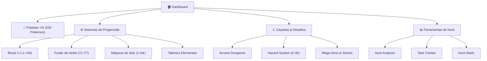

# Dashboard & Centro Tático - Poke Alliance

Painel de controle central para acompanhamento de eventos diários, status do meta e acesso rápido às ferramentas de caça e progressão.

> **TL;DR:** Roteiro rápido do dia: resgate seus **Online Points** a cada 5min, complete a **Dungeon Diária** para garantir seu Arcane Shard, realize as **Tasks de Guild** para farmar tokens de Held e mantenha a **TV Cam** ativa para garantir +5% de bônus Shiny.

---

## 1. Status Geral do Servidor & Bônus Ativos

| Métrica / Sistema | Status / Valor | Detalhes & Regra Mecânica |
| :--- | :--- | :--- |
| **Versão & Conteúdo** | **Roadmap 2026** | **530 Pokémon** disponíveis em **7 Gerações** (Kanto: 151, Johto: 122, Hoenn: 135, Sinnoh: 108, Unova: 6, Kalos: 7, Alola: 1). |
| **Online Points** | **Ativo (Ciclo 5 min)** | Concede pontos a cada 5 minutos conectado. Troca direta por Suprimentos e Boosts de XP. |
| **Bônus de Transmissão (TV Cam)** | **+5% Spawn Shiny** | Ativar a transmissão interna via NPC Jully concede bônus passivo de taxa Shiny. |
| **Comunidade & Lotação** | **Recorde Batido** | Evento de taxa global de Shinies ativado por marco de jogadores simultâneos. |
| **GamePass & Calendário** | **Temporada Vigente** | Recompensas de login diário e trilha de tarefas por nível de passe. |

---

## 2. Checklist de Rotinas: Diárias & Semanais

Mantenha sua progressão em dia concluindo os ciclos obrigatórios de reinicialização.

### 📅 Atividades Diárias
- **Dungeon Diária (Arcane Shard):** Conclua 1 instância de Dungeon (Easy, Medium ou Hard) para receber 1 Arcane Shard diário correspondente à dificuldade.
- **Doações & Missões de Guild:** Realize a doação diária (100k a 300k gold) e conclua as missões de clã para acumular **Guild Tokens** (moeda para compra de Helds).
- **Prey System:** Ative suas 2 opções de bônus de criatura diárias (XP ou Loot extra) antes de iniciar as caçadas em rota.
- **PokéExpedition & World Tasks:** Inicie expedições passivas do time secundário e verifique a rotação de caçadas no **Task Tracker**.

### 📆 Atividades Semanais
- **Rockets Semanais:** Batalhas de facção com drops de insumos raros e contratos especiais.
- **Policiais Semanais:** Caçadas de recompensas alternativas para farm de supplies e reputação.
- **Rotação de GYMs (Kanto/Hoenn):** Complete os 8 líderes de Kanto para obter insígnias necessárias para os talentos de **Cooldown Reduction (CDR de Bag)** — até 8s de redução para Pokémon guardados.

---

## 3. Hub de Acesso Rápido (Quick Access)

Navegue diretamente para os módulos principais da wiki:

### 🐉 Pokédex V5
- Catálogo completo com 530 Pokémon, tabela de fraquezas/resistências, lista de moves com tags mecânicas (`[AOE]`, `[Single]`, `[Buff]`) e metas de abate do **PokéLog**.

### ⚙️ Sistemas de Fortalecimento
- **Boost System:** Aprimoramento permanente de +1 a +50 na Poké Ball. Cada +1 equivale a +3 níveis no cálculo de dano.
- **Máquina de Star:** Ascensão garantida (100% de chance) de 1 a 5 Stars consumindo exemplar idêntico do mesmo tier.
- **Held Items:** Sistema de fusão (3 itens do mesmo tier no Depot Locker 5) e remoção segura via Lucky Amulet.
- **Talentos:** Árvores de especialização elemental abastecidas com itens de bosses e Shinies.

### ⚔️ Desafios de Endgame
- **Hazard Mode:** Ajuste de risco de 0 a 30 em Hoenn (+5% XP e +0,5% Loot por nível; penalidade proporcional em dano/defesa).
- **Mega Dens:** Portais de chefes para liberação de **Sealed Mega Stones** e evolução em combate (`!automega on`).

---

## 4. Guia Tático & Estratégia de Mercado

> [!NOTE]
> Este conteúdo foi gerado com análise dos parceiros da Poke Alliance.

### 🎯 Rota de Leveling Otimizada (Nível 1 ao 150)
- **Foco Absoluto em Tasks:** Não realize grind aleatório. Siga estritamente as **Linked Tasks** e as **Tasks do Mundo** através do Task Tracker desde o nível 1.
- **Sustentação por Online Points:** Não desperdice pontos da loja online em cosméticos no early game. Converta tudo em **Boosts de XP** e **Supplies** (Potions/Revives).
- **Eficiência de Roster:** Evite investir recursos pesados em Pokémon iniciais de baixo escalonamento. Guarde gold e pedras para o time de transição do nível 150.

### 🛡️ Transição Pós-150 (Wild Escape & Roster Elemental)
- **Hunts Especializadas:** A partir do nível 150, criaturas do mapa comum deixam de fornecer taxa ideal de XP. A progressão migra para a **Wild Escape (Redscape)**.
- **Composições Mono-Alvo para Caça:** Monte um Pokémon especialista para cada tipo de hunt:
  - **Contra Elétricos:** Utilize `Steelix` (+3 Boost + Held Boost Tier 3) para farm consistente.
  - **Contra Planta:** Utilize `Arcanine` para clear speed em área com vantagem elemental.
  - **Contra Pedra/Fogo:** Utilize `Gyarados`.
- **Ingresso em Guilds:** Obrigatório a partir do nível 150 para habilitar os bônus passivos e a compra de Helds com tokens diários.

### 💰 Economia & Arbitragem de Mercado (Market Making)
O mercado gira em torno dos materiais de ascensão de Talentos Elementais. Identifique escassez no Market (`Ctrl + T`) e farme itens de alto valor:

| Material de Craft | Fonte / Drop | Aplicação no Meta | Faixa de Preço Estimada |
| :--- | :--- | :--- | :--- |
| **Electric Heart Tail** | Shiny Pikachu | Talento Elétrico | ~230.000 gold (Alta Liquidez) |
| **Fire Roof** | Rapidash | Talento de Fogo | ~2.000 gold/un (200k por hunt de 15min) |
| **Electric Chip** | Raichu / Ânforas | Insumo de Sistema | ~1.500 gold/un (Venda em lote rápido) |

---

## 5. Referência Rápida de Comandos

<strong>Expandir Tabela de Comandos do Cliente</strong>

### Informações e Status
- `!online` ou `/online` — Exibe a quantidade total de treinadores conectados.
- `!buffs` — Lista bônus ativos (XP Boost, Shiny Charm, Lucky, Captura).
- `!food` — Exibe o tempo restante dos efeitos de comida ativa.
- `!redeemcode nitro,[CÓDIGO]` — Resgata recompensas promocionais.

### Combate e Controle
- `m1` até `m12` — Executa a habilidade correspondente ao slot.
- `!autocombo m1,m2,m3` — Configura rotação automática de golpes na ordem informada.
- `t1`, `t2`, `t3`, `t4` — Rotaciona a direção do Pokémon (Norte, Leste, Sul, Oeste).
- `!automega on` — Ativa o acionamento automático de Mega Evolução em combate.
- `!pokestop` — Pausa movimentação e ataques do Pokémon ativo.

### Locomoção
- `/tp [Nome da Cidade]` — Teleporta para o Centro Pokémon da cidade desbloqueada.
- `!fly`, `!surf`, `!ride` — Ativa o meio de locomoção do Pokémon equipado.

