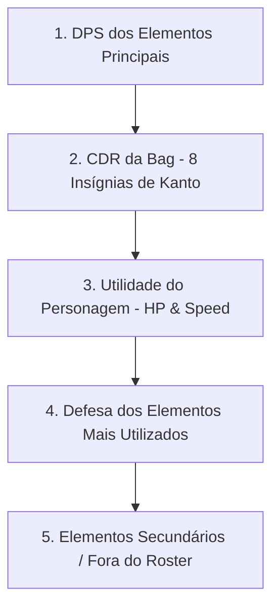
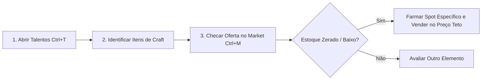

# Progressão de Personagem e Economia

Guia de otimização mecânica do Treinador. Aqui você encontra as taxas matemáticas de talentos, o funcionamento do Medal System e PokéLog, o gerenciamento de itens essenciais e estratégias de mercado para geração de capital.

---

## TL;DR (Resumo Tático)
- **Talentos:** Entregas permanentes de itens via inventário ou Depot Stash. Garantem até **+3.200 HP**, **+80 Velocidade**, **+10% Dano Crítico**, **+1% Chance Crítica**, **+29% Dano Ofensivo** e **+13% Defesa** por elemento, além de **8s de CDR na Bag** (via 8 Insígnias de Kanto).
- **Medal System:** Medal Boxes obtidas em Tasks do Mundo e Quests concedem medalhas equipáveis com atributos passivos e bônus de zona (ex: mitigação de Hazard em Hoenn).
- **PokéLog:** Sistema escalonado de metas de abate por espécie que desbloqueia recompensas, experiência bruta e runas de atributos.
- **Itens Críticos:** **Lucky Amulet** (Nível 250) replica 50% do efeito do Held X-Lucky para toda a bag; **Helds** fundem em proporção 3:1 (25% de sucesso por tier); **Star Ascension** garante dano cumulativo sem chance de falha.
- **Market & Economia:** O método mais eficiente de enriquecimento consiste em arbitrar materiais escassos exigidos na tabela de Talentos (`Ctrl + T`) e itens de criaturas Shiny.

---

## 1. Sistema de Talentos

O sistema de talentos concede bônus permanentes e cumulativos ao Treinador e aos Pokémon sob seu comando.

### Mecânica de Desbloqueio e Entrega
1. Acesse o painel de **Talentos** (`Ctrl + T`).
2. Filtre pela categoria desejada (**Personagem**, **Ambiente** ou **Elemento**).
3. Selecione a etapa do talento para visualizar a lista exata de materiais exigidos.
4. Clique em **Entregar**. O sistema consome automaticamente os itens presentes no seu inventário ou no **Depot Stash**.
5. Conclua todos os requisitos da etapa para ativar o modificador passivo permanentemente.

> [!IMPORTANT]
> Talentos **não utilizam pontos distribuíveis** e **não possuem sistema de reset**. Todos os materiais entregues são consumidos de forma irreversível. Talentos avançados possuem travas nos níveis **350**, **400** e **500**.

### Tabela Mestra de Atributos Máximos

| Grupo de Talento | Modificador Máximo | Requisitos / Origem Principal |
| :--- | :--- | :--- |
| **Dano Ofensivo Elemental** | `+29%` (por elemento) | Materiais elementais + Drops de criaturas da tipagem (18 elementos) |
| **Defesa Elemental** | `+13%` (por elemento) | Materiais defensivos + Drops de criaturas da tipagem (18 elementos) |
| **Vida Máxima (HP)** | `+3.200 HP` | Materiais de sobrevivência e essências de vida |
| **Velocidade do Treinador** | `+80 Velocidade` | Drops de mobilidade e itens de agilidade |
| **Chance de Crítico** | `+1,0%` (ponto percentual) | Itens raros de precisão e insígnias |
| **Dano Crítico** | `+10,0%` | Materiais ofensivos refinados |
| **Mobilidade Ambiental** | `+100` (Neve, Areia e Água) | Materiais de resistência climática específicos de cada bioma |
| **CDR da Bag (Cooldown Reduction)** | `8 Segundos` (1s por etapa) | 8 Insígnias dos Líderes de Ginásio de Kanto |

### Cooldown Reduction (CDR) na Bag e os GYMs de Kanto
As 8 etapas de Redução de Cooldown do Personagem exigem a entrega das 8 insígnias de Kanto obtidas ao derrotar os respectivos Líderes de Ginásio.

- **Efeito Mecânico:** Cada insígnia entrega **-1 segundo** de tempo de recarga nas habilidades dos Pokémon guardados dentro das Poké Balls na bag.
- **Impacto no Meta PvE:** Essencial para caçadas em Hoenn e áreas de alta densidade (Hazard/Mega Dens), permitindo alternar Pokémon continuamente sem travar a rotação de dano em área (AoE).

### Ordem Recomendada de Priorização

---

## 2. Conquistas e Medal System

### Conquistas (Achievements)
O sistema de conquistas rastreia marcos de desempenho, exploração e progressão geral:
- **Categorias:** Leveling, Capturas Totais, Dungeons Concluídas, Desafios Semanais e Tasks do Mundo.
- **Exibição:** Painel estruturado com barras de progresso percentual e gatilhos de recompensas automáticas ao atingir marcos (100%, 500 abates, etc.).

### Medal System (Medalhas e Medal Box)
As medalhas atuam como insígnias de prestígio e agregam bônus passivos à conta do jogador:
- **Origem:** Recompensas de NPCs de Tasks Globais (ex: *NPC Cedric*), Quests Principais e conquistas de alto nível.
- **Medal Box:** Item que armazena as medalhas obtidas e permite gerenciar as insígnias ativas na vitrine de perfil.
- **Buffs de Zona:** Medalhas específicas concedem atributos como `+5 de Progressão Hazard em Hoenn`, reduzindo o dano residual recebido em ambientes hostis.

---

## 3. PokéLog e Registro de Caçada

O PokéLog monitora o histórico de combate e recompensa o Treinador por erradicar populações específicas de Pokémon.

### Estrutura de Estágios
Cada criatura registrada na Pokédex possui marcos de abates divididos em estágios sucessivos:

| Estágio | Meta Típica de Abates | Recompensas Típicas |
| :---: | :--- | :--- |
| **Tier 1** | 100 a 250 Abates | Suprimentos básicos (Poké Balls, Revives), Ouro e XP Bruta. |
| **Tier 2** | 500 a 1.000 Abates | Tokens de Recompensa, Elixires e Materiais de Craft. |
| **Tier 3 (Master)** | 2.500+ Abates | Runas de Atributo permanentes, Bônus de Captura e Medalhas exclusivas. |

### Integração com Omnisearch e Pokédex
- Ao consultar um Pokémon via Omnisearch (`Ctrl + K`) ou Pokédex V5, a aba **PokéLog** exibe em tempo real o contador de abates atual, a meta do próximo nível e a lista exata de drops desbloqueáveis.

---

## 4. Itens-Chave e Equipamentos de Progressão

### Lucky Amulet (Amuleto da Sorte Global)
- **Requisito de Uso:** Nível 250+.
- **Desbloqueio:** Conclua a missão da relíquia com o *Captain Willy* (docas ao sul de Olivine) e vença o puzzle subaquático em Dive (leste de Vermilion; limite de 60 min, 3 instâncias simultâneas).
- **Mecânica:** Permite transferir um Held `X-Lucky` equipado em um Pokémon para o amuleto. Quando equipado no Treinador, o amuleto concede **50% da efetividade do X-Lucky para todos os 6 Pokémon da Bag simultaneamente**.

### Sistema de Helds e Held Fusion
Equipados diretamente na Poké Ball para alterar as propriedades matemáticas de combate.

| Tier | Custo de Fusão (Depot 5) | Taxa de Sucesso | Resultado |
| :---: | :---: | :---: | :--- |
| **T1 $\rightarrow$ T2** | 3x Helds T1 quaisquer | `25%` | 1x Held Ticket T2 (Aleatório) |
| **T2 $\rightarrow$ T3** | 3x Helds T2 quaisquer | `25%` | 1x Held Ticket T3 (Aleatório) |
| **T3 $\rightarrow$ T4** | 3x Helds T3 quaisquer | `25%` | 1x Held Ticket T4 (Aleatório) |
| **T4 $\rightarrow$ T5** | 3x Helds T4 quaisquer | `25%` | 1x Held Ticket T5 (Aleatório) |
| **T5 $\rightarrow$ T6** | 3x Helds T5 quaisquer | `25%` | 1x Held Ticket T6 (Aleatório) |
| **T6 $\rightarrow$ T7** | 3x Helds T6 quaisquer | `25%` | 1x Held Ticket T7 (Aleatório) |

> [!NOTE]
> Em caso de falha no processamento, os três Helds utilizados são destruídos.

### Máquina de Star (Star Ascension)
- **Função:** Aumenta o dano base do Pokémon consumindo uma cópia idêntica (mesma espécie, mesmo tier e mesma contagem de Stars atual).
- **Taxa de Sucesso:** `100%` (Sem chance de quebra ou falha).
- **Escala de Poder:** Limite de 5 Stars por Pokémon. O bônus varia conforme a raridade (Tiers T3 a T1, Super Rare, Ultra Rare e Legendary).

### Sistema de Boost (+0 a +50)
- **Mecânica:** Cada `+1` de Boost equivale a **3 níveis extras no cálculo de dano das magias** do Pokémon (um Pokémon `+50` opera com o equivalente a +150 níveis de escalonamento).
- **Pedras Utilizadas:** Novice (+0 a +5), Elemental (+5 a +10), Common (+10 a +15), Enhanced (+15 a +20), Potent (+20 a +25), Advanced (+25 a +30). Devem coincidir com ao menos um elemento do Pokémon.

### Suprimentos e Utilitários de Eficiência
- **Starter Box (`Store > Character`):** Caixa de resgate gratuito no início do jogo com suprimentos de sustentação (Balls e Revives).
- **Estrela de XP:** Consumível que dobra (+100%) a experiência obtida durante 60 minutos.
- **Online Points:** Moeda temporal gerada a cada 5 minutos de conexão ativa. Permite comprar boosts e consumíveis sem custo em Gold.
- **Cam System:** Transmissão interna ativada concede **+5% de bônus de experiência** passivo.

---

## 5. Market & Economia Tática (Como Fazer Dinheiro / Ficar Rico)

> [!NOTE]
> Este conteúdo foi gerado com análise dos parceiros da Poke Alliance.

O mercado de Poke Alliance é orientado pela demanda direta dos sistemas de **Talentos** e **Refinamento**. Compreender os gargalos de materiais é o método mais veloz para acumular Gold e Diamonds.

### Método da Engenharia Reversa de Talentos
A técnica consiste em monitorar os requisitos da tabela de talentos e cruzar com a oferta do Market (`Ctrl + M`):

### Catálogo de Itens de Alta Liquidez e Lucro

#### 1. Itens Exclusivos de Criaturas Shiny
- **Electric Heart Tail (Shiny Pikachu):** Item de alta demanda para o talento de dano elétrico. Valor médio de mercado: **~230k Gold** por unidade.
- **Drops de Shiny Pidgeot e Clefable:** Insumos requisitados para talentos de mobilidade e velocidade.
- **Dark Beat & Fada Drops:** Comprados rapidamente por jogadores de high-level acelerando suas árvores.

#### 2. Drops Comuns com Escassez Crítica
- **Fire Roof (Rapidash):** Material obrigatório para progressão de Fogo. Quando o estoque do market zera, unidades individuais atingem **2k Gold** (rendendo **~200k Gold** em 15-20 minutos de hunt focada).
- **Electric Chip (Raichu / Ampharos):** Consumido em massa para talentos e crafts de pedras. Vendas em lotes de 1.000 unidades a **1.5k Gold** cada garantem capital imediato.
- **Giant Piece & Pedras Brutas:** Materiais de terra e pedra com consumo contínuo.

#### 3. Orbs Elementais (Simple Orbs)
- **Simple Dark Orb:** Negociada na faixa de **~500k Gold** devido à escassez de caçadores no bioma.
- **Simple Ice Orb:** Negociada em torno de **~300k Gold**.
- **Orbs Comuns:** Negociadas entre **9k e 10k Gold**.

### Economia de Guilda e Dailies
- **Missões Diárias de Guild:** Geram entre **100k e 300k Gold** por dia ao jogador, além de Guild Tokens.
- **Guild Tokens:** Moeda de troca direta por **Helds** no NPC de Clã, eliminando a necessidade de compra no mercado convencional.
- **Linked Tasks (Tarefas Vinculadas):** Realizadas desde o nível 1 (de Ratata a Ampharos) para abastecer a bag com Ultra Balls, Revives e Estrelas de XP sem gastar reservas de capital.
