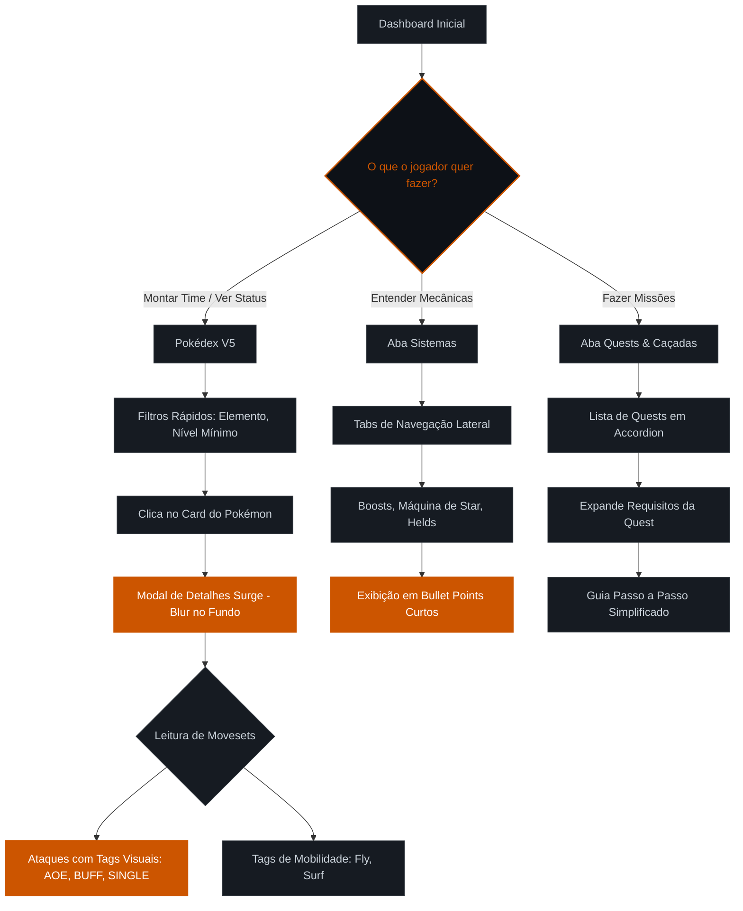

# User Flow - Poke Alliance Wiki (Dashboard SPA)

Este documento mapeia a jornada do usuário dentro da nossa Wiki Local, focada em otimização para TDAH (Progressive Disclosure, Modais, Semântica de Cores).

## Fluxograma Principal

## Decisões de UX para Neurodivergência (TDAH)
- **Zero Poluição Visual:** Toda informação densa (ex: Movesets) está escondida até que o usuário clique no Card (Modal).
- **Ancoragem Visual e Tags:** Uso de `[AOE]` e cores elementais quebra a parede de texto, permitindo um scanning rápido da tela.
- **Micro-interações (Progressive Disclosure):** Accordions e Tabs (na área de Sistemas e Quests) garantem que o usuário consuma apenas uma regra ou quest de cada vez, evitando paralisia por análise e sobrecarga cognitiva.
