# User Flow Interativo - Poke Alliance Wiki (Modern V2)

Este documento mapeia todas as jornadas e ramificações que o jogador pode realizar dentro da nossa Wiki. Ele serve como o **mapa oficial** para guiar a construção do código e UI nas próximas sessões.

## Fluxograma Global

```mermaid
graph TD
    %% Base e Navegação Global
    Start((Início da Sessão)) --> NavGlobal{Navegação Global}
    NavGlobal --> |Foco Direto| Omni[Omnisearch Ctrl+K]
    NavGlobal --> |Navegação Guiada| Sidebar[Sidebar / Bottom Nav]

    %% Omnisearch Flow
    Omni --> OmniResult[Painel de Resultados Flutuante]
    OmniResult -.-> |Hover/Preview| Tooltip[Tooltip de Stats]
    OmniResult --> |Enter| ModalDetalhes

    %% 1. Dashboard
    Sidebar --> H[1. Dashboard Home]
    H --> H1[Cards de Eventos / TL;DR]
    H --> H2[Atalhos Rápidos de Busca]

    %% 2. Pokédex V5
    Sidebar --> P[2. Pokédex V5]
    P --> PF[Filtros: Elementos, Nível, Tier]
    PF --> PG[Grid de Cards de Pokémon]
    PG --> |Clique no Card| ModalDetalhes[Overlay / Modal de Detalhes]
    
    %% Detalhes do Modal
    ModalDetalhes --> MT1[Aba: Status Base]
    ModalDetalhes --> MT2[Aba: Moveset + Tags AOE/Buff]
    ModalDetalhes --> MT3[Aba: Loot & Spawns]
    ModalDetalhes --> MT4[Aba: Pokelog Meta]

    %% Comunidade Meta (Dentro de Pokédex)
    P --> Meta[Módulos da Comunidade]
    Meta --> Meta1[Guia de Times / Rotação]
    Meta --> Meta2[Tierlist Democrática]

    %% 3. Sistemas
    Sidebar --> S[3. Sistemas & Mecânicas]
    S --> S1[Abas de Navegação Interna]
    S1 --> SB[Boosts] --> SBC[Tabelas por Elemento]
    S1 --> SH[Helds] --> SHC[Tabela e Efeitos Matemáticos]
    S1 --> SM[Máquina de Star]

    %% 4. Quests e NPCs
    Sidebar --> Q[4. Quests & NPCs]
    Q --> Q1[Catálogo de NPCs e Ofertas]
    Q --> Q2[Lista de Quests em Accordion]
    Q2 --> |Abrir Quest| Q3[Página da Quest]
    Q3 --> Q3_A[TL;DR e Requisitos]
    Q3 --> Q3_B[Guia com Micro-Tooltips no Texto]

    %% 5. Personagem
    Sidebar --> Char[5. Personagem]
    Char --> C1[Talentos] --> C1_T[Tabelas: Personagem, Pokémon, Elemento + Crafting]
    Char --> C2[Achievements] --> C2_P[Barras de Progresso]
    Char --> C3[Medalhas] --> C3_G[Grid Vitrine de Buffs]
    Char --> C4[Pokelog Pessoal]

    %% 6, 7 e 8: Mundo e Evolução
    Sidebar --> M[6. Minimapa Web] --> MF[Filtros de Marcação]
    Sidebar --> R[7. Regiões] --> RD[Requisitos, Biomas, Level Mínimo]
    Sidebar --> L[8. Guia de Leveling] --> LR[Rotas Otimizadas por Elemento/Level]

    %% Estilização do Grafo (Regras Cognitivas)
    classDef global fill:#161b22,stroke:#30363d,stroke-width:1px,color:#c9d1d9;
    classDef search fill:#0d1117,stroke:#CC5500,stroke-width:2px,color:#CC5500;
    classDef modal fill:#CC5500,stroke:#CC5500,stroke-width:1px,color:#fff;
    classDef core fill:#1A1D24,stroke:#475569,stroke-width:1px,color:#E2E8F0;
    
    class Omni,OmniResult search;
    class ModalDetalhes,MT1,MT2,MT3,MT4 modal;
    class H,P,S,Q,Char,M,R,L core;
```

## Regras Críticas de Interação (Handoff para UI)
As próximas sessões que codificarem a interface devem respeitar este fluxo baseando-se nas seguintes regras:

1. **Zero Redirect (Foco Contínuo):** A jornada do usuário raramente o joga para uma "nova página" longa. Informações detalhadas sobre entidades do jogo surgem em **Modais sobrepostos (Blur no fundo)** ou **Painéis Flutuantes (Tooltips)**.
2. **Corte Vertical de Conteúdo:** O fluxo previne o *Scroll Infinito* dividindo o conteúdo horizontalmente através de **Tabs (Abas)** em áreas pesadas como Pokédex (Status, Moveset) e Sistemas (Boosts, Helds).
3. **Ponto de Partida Acelerado:** A busca `Omnisearch` encurta o caminho do usuário permitindo saltar o *NavGlobal* e cair direto no *Modal de Detalhes* de um Pokémon, Quest ou Item, reduzindo drasticamente o *Interaction Cost* (custo de clique).
